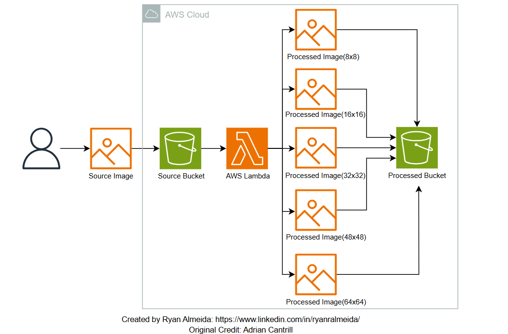

# Build a Serverless Image Processing App 
## Project Description:
This project creates a simple image processing app, which uses two s3 Buckets and a Lambda function. This project was built alognside a tutorial created by Adrian Cantrill, and can be found [here](https://github.com/acantril/learn-cantrill-io-labs/tree/master/00-aws-simple-demos/aws-lambda-s3-events)

## Architecture:

   
## Components Description:
| Component           | Functionality                                                                                                                                  |
| ------------------- | ---------------------------------------------------------------------------------------------------------------------------------------------- |
| Source S3 Bucket    | A source to upload your images from your local machine                                                                                         |
| Lambda Function     | Invoked whenver an image is dropped into the Source S3 bucket. The Lambda function parses the event, loads source object, and generates output |
| Processed S3 Bucket | A destination where processed images from the lambda function are placed                                                                       |
## Learning Outcomes:
This project is an excellent stepping stone for learning serverless computing and AWS services. Below is a detailed summary of the key learning outcomes:
- Understanding Serverless Architecture: You learn how AWS Lambda enables serverless execution by handling image processing tasks without provisioning or managing servers.
- Event driven workflows: Explor how Lambda functions are triggered automatically by specific AWS events (in this case, an object upload in an S3 bucket).
- Image Processing and Python Libraries: Use libraries like PIL (Python Imaging Library) or Pillow to resize images into multiple resolutions.
- Identity and Access Management: Learn how to create and attach IAM roles with least-privilege permissions for Lambda to interact with S3 buckets securely.
